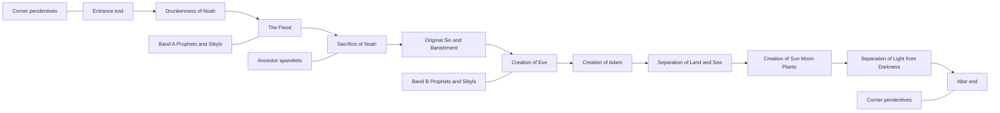
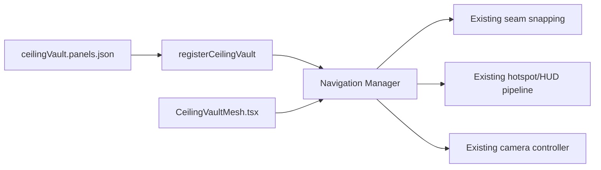

# Analytical Reconstruction of the Sistine Chapel Virtual Tours

## Method and source basis

This reconstruction prioritises the two official tour URLs you supplied, then expands only to other official Vatican Museums ceiling pages, official image assets linked from those pages, the official Vatican Museums map PDF, and a small number of secondary art-historical references where the official tour pages do not expose a field directly. The critical constraint is that both interactive tour endpoints are JavaScript-gated in this browsing environment: the newer Musei Vaticani tour shell exposes only its title in the raw HTML, while the legacy Vatican VR endpoint yields only an error page saying “Javascript not activated.” That means the **semantic ceiling layout** can be extracted confidently from the official Sistine Chapel content hierarchy and official linked images, but the tours’ underlying pano XML, hotspot coordinates, and tile pyramids are **not directly exposed** here and must be marked **UNSPECIFIED** unless safely reconstructed. citeturn3view0turn2view1turn5view0turn6view0

For the rest of this report, I use a **canonical ceiling-atlas coordinate frame** designed for production use rather than claiming it was explicitly published by the Vatican. The axes are: **`u`** from the **entrance wall** at `0.0` to the **altar wall** at `1.0`, and **`v`** from **Band A** at `0.0` to **Band B** at `1.0`, where Band A and Band B correspond to the two long-side rows as they appear in the official ceiling scheme and official composite images. I intentionally use **Band A/B** rather than “north/south” because the accessible official pages do not explicitly bind the scheme image’s top and bottom rows to a geographic wall orientation. All `u/v/w/h` values below are therefore **derived authoring coordinates**, not extracted tour internals. The derivation is based on the official ceiling scheme image and the official grouped images for central stories, prophets and sibyls, spandrels, and pendentives. citeturn7view4turn11view0turn11view1turn11view2turn11view3

A second important distinction is between **art-historical reading order** and **physical vault order**. The official Vatican Museums pages explain the iconographic grouping of the nine central Genesis scenes, while standard art-historical references note that the narrative is conventionally read facing the altar, even though Michelangelo physically painted from the entrance end toward the altar. For implementation, a physical authoring axis is more useful, so the dataset below is normalised in **entrance-to-altar physical order**. citeturn10view0turn9view0turn27search5

## Report A Musei Vaticani virtual tour

**Executive summary.** The modern Musei Vaticani tour is the better-documented of the two official tours because it sits beside a full Vatican Museums content hierarchy for the Sistine Chapel. The virtual-tour shell itself exposes only the title **“Sistine Chapel Virtual Tour – Floor and High Level View”**, but the surrounding official chapel pages provide the ceiling’s structural breakdown into **central stories**, **prophets and sibyls**, **spandrels**, and **pendentives**, plus an official **scheme of the ceiling** image and grouped ceiling images. That is enough to reconstruct a production-grade ceiling dataset with stable IDs, canonical order, grouped semantics, and safe derived coordinates. What remains missing from the official source surface is the actual pano engine metadata: no yaw/pitch hotspots, no XML scene file, no explicit zoom levels, and no tile manifest are exposed in the browsable HTML here, so those fields must remain **UNSPECIFIED**. citeturn3view0turn6view0turn10view0turn7view4turn11view0turn11view1turn11view2turn11view3

The official ceiling overview page states the core structural scheme plainly: Michelangelo placed **nine central stories from Genesis**, **twelve prophets and sibyls** on monumental thrones, Christ’s forefathers in the **spandrels** and lunettes, and **four corner pendentives** with episodes of Israel’s salvation. The same page links directly to the official ceiling scheme image. The grouped subpages then add short interpretive descriptions: the central stories are organised in three triads around the creation of the universe, man, and evil; prophets and sibyls alternate along the long sides, with **Zechariah** at the entrance end and **Jonah** above the altar; the eight spandrels continue the forebears of Christ and remain partly disputed in precise identification; and the four corner pendentives connect ceiling and wall narratives through salvation episodes. citeturn10view0turn9view0turn9view1turn9view2turn9view3

The same official ecosystem also gives two practical implementation clues. First, the direct tour-shell title explicitly names **two authored camera states**, “floor” and “high level,” which is enough to justify a two-node camera model for ceiling inspection. Second, the official image assets are all served from the Museums’ DAM path, and the grouped images clearly separate the same four ceiling subdomains that a codebase should preserve: central strip, vigils, ancestor spandrels, and corner pendentives. citeturn3view0turn11view0turn11view1turn11view2turn11view3

### Musei Vaticani extraction table

The table below uses **derived atlas coordinates** from the official scheme and grouped ceiling images. `fov` is a **safe authoring recommendation** for a dedicated “high” inspection node because the tour shell title confirms a higher-level view, but no official camera numbers are exposed. Description text is paraphrased from the official Vatican Museums pages where available; where an individual official description was not surfaced in accessible lines, the wording is normalised from the official group page plus standard canonical identification. citeturn3view0turn9view0turn9view1turn9view2turn9view3turn11view4turn12view3turn12view4turn12view5turn27search5turn20search0

| ID | Panel | Subgroup | Slot | Derived centre `u,v` | Derived box `w,h` | Suggested node / FOV | Description | Status |
|---|---|---|---|---:|---:|---|---|---|
| GEN-01 | Drunkenness of Noah | Genesis | Central bay 1 | 0.10, 0.50 | 0.07, 0.18 | high / 34° | Noah tills the earth after the Flood and is found drunk. citeturn9view0turn27search5 | Tour-local yaw/pitch UNSPECIFIED |
| GEN-02 | The Flood | Genesis | Central bay 2 | 0.20, 0.50 | 0.10, 0.20 | high / 30° | Humanity struggles for safety as the ark survives in the background. citeturn11view4 | Tour-local yaw/pitch UNSPECIFIED |
| GEN-03 | Sacrifice of Noah | Genesis | Central bay 3 | 0.31, 0.50 | 0.07, 0.18 | high / 34° | Noah’s family offers sacrifice after deliverance from the Flood. citeturn9view0turn27search5 | Tour-local yaw/pitch UNSPECIFIED |
| GEN-04 | Original Sin and Banishment | Genesis | Central bay 4 | 0.42, 0.50 | 0.10, 0.20 | high / 30° | Temptation and expulsion are combined into one cause-and-effect image. citeturn12view5 | Tour-local yaw/pitch UNSPECIFIED |
| GEN-05 | Creation of Eve | Genesis | Central bay 5 | 0.53, 0.50 | 0.07, 0.18 | high / 34° | Eve rises from Adam in the middle triad on the creation of man and woman. citeturn9view0turn27search5 | Tour-local yaw/pitch UNSPECIFIED |
| GEN-06 | Creation of Adam | Genesis | Central bay 6 | 0.64, 0.50 | 0.10, 0.20 | high / 28° | God reaches toward Adam to transmit the breath of life. citeturn12view3 | Tour-local yaw/pitch UNSPECIFIED |
| GEN-07 | Separation of Land and Sea | Genesis | Central bay 7 | 0.75, 0.50 | 0.07, 0.18 | high / 34° | The second-day / third-day creation cycle includes the division of waters and land. citeturn9view0turn27search5 | Tour-local yaw/pitch UNSPECIFIED |
| GEN-08 | Creation of the Sun, Moon and Plants | Genesis | Central bay 8 | 0.86, 0.50 | 0.10, 0.20 | high / 30° | God simultaneously creates vegetation and the celestial lights. citeturn12view4 | Tour-local yaw/pitch UNSPECIFIED |
| GEN-09 | Separation of Light from Darkness | Genesis | Central bay 9 | 0.95, 0.50 | 0.06, 0.18 | high / 34° | God divides light from darkness at the altar-end culmination of the cycle. citeturn9view0turn27search5 | Tour-local yaw/pitch UNSPECIFIED |
| VIG-01 | Zechariah | Prophet | Entrance end | 0.04, 0.50 | 0.06, 0.18 | high / 28° | Entrance-end prophet marking the ceremonial threshold. citeturn9view1turn20search0 | Exact pano waypoint UNSPECIFIED |
| VIG-02 | Joel | Prophet | Band A bay 1 | 0.12, 0.22 | 0.06, 0.18 | high / 32° | First figure from the entrance on one long-side band. citeturn27search3turn11view1 | Band A/B mapping derived |
| VIG-03 | Erythraean Sibyl | Sibyl | Band A bay 2 | 0.29, 0.22 | 0.06, 0.18 | high / 32° | Long-side sibyl in alternating prophetic sequence. citeturn20search0turn11view1 | Exact bay assignment medium confidence |
| VIG-04 | Ezekiel | Prophet | Band A bay 3 | 0.47, 0.22 | 0.06, 0.18 | high / 32° | Long-side prophet in alternating throne sequence. citeturn9view1turn20search0turn11view1 | Exact bay assignment medium confidence |
| VIG-05 | Persian Sibyl | Sibyl | Band A bay 4 | 0.66, 0.22 | 0.06, 0.18 | high / 32° | Described in secondary placement as near the altar half of the cycle. citeturn19search8turn11view1 | Exact bay assignment medium confidence |
| VIG-06 | Jeremiah | Prophet | Band A bay 5 | 0.84, 0.22 | 0.06, 0.18 | high / 32° | Penultimate long-side prophet before Jonah. citeturn20search0turn11view1 | Exact bay assignment medium confidence |
| VIG-07 | Jonah | Prophet | Altar end | 0.96, 0.50 | 0.06, 0.18 | high / 28° | Above the altar, prefiguring Christ. citeturn9view1turn19search7 | Exact pano waypoint UNSPECIFIED |
| VIG-08 | Libyan Sibyl | Sibyl | Band B bay 5 | 0.84, 0.78 | 0.06, 0.18 | high / 32° | Long-side sibyl near the altar end. citeturn20search0turn11view1 | Exact bay assignment medium confidence |
| VIG-09 | Daniel | Prophet | Band B bay 4 | 0.66, 0.78 | 0.06, 0.18 | high / 32° | Stated in secondary source as second on the right from the high altar. citeturn23search5turn11view1 | Exact band mapping derived |
| VIG-10 | Cumaean Sibyl | Sibyl | Band B bay 3 | 0.47, 0.78 | 0.06, 0.18 | high / 32° | Large sibyl on the opposite long-side band. citeturn20search0turn11view1 | Exact bay assignment medium confidence |
| VIG-11 | Isaiah | Prophet | Band B bay 2 | 0.29, 0.78 | 0.06, 0.18 | high / 32° | Stated in secondary source as third bay from the entrance. citeturn19search9turn11view1 | Exact band mapping derived |
| VIG-12 | Delphic Sibyl | Sibyl | Band B bay 1 | 0.12, 0.78 | 0.06, 0.18 | high / 32° | Stated in secondary source as first bay from the entrance. citeturn19search6turn11view1 | Exact band mapping derived |
| ANC-01 | Ancestor Spandrel A1 | Ancestors | Band A triangle 1 | 0.18, 0.08 | 0.08, 0.12 | high / 38° | Group of Christ’s forebears; precise biblical identification remains disputed. citeturn9view3turn11view3 | Official name UNSPECIFIED |
| ANC-02 | Ancestor Spandrel A2 | Ancestors | Band A triangle 2 | 0.38, 0.08 | 0.08, 0.12 | high / 38° | Group of forebears; use stable positional ID pending stronger attribution. citeturn9view3turn11view3 | Official name UNSPECIFIED |
| ANC-03 | Ancestor Spandrel A3 | Ancestors | Band A triangle 3 | 0.60, 0.08 | 0.08, 0.12 | high / 38° | Group of forebears; official page warns exact identifications remain contested. citeturn9view3 | Official name UNSPECIFIED |
| ANC-04 | Ancestor Spandrel A4 | Ancestors | Band A triangle 4 | 0.80, 0.08 | 0.08, 0.12 | high / 38° | Group of forebears; upper-row triangle in official scheme. citeturn7view4turn9view3 | Official name UNSPECIFIED |
| ANC-05 | Ancestor Spandrel B1 | Ancestors | Band B triangle 1 | 0.18, 0.92 | 0.08, 0.12 | high / 38° | Group of forebears; lower-row triangle in official scheme. citeturn7view4turn9view3 | Official name UNSPECIFIED |
| ANC-06 | Ancestor Spandrel B2 | Ancestors | Band B triangle 2 | 0.38, 0.92 | 0.08, 0.12 | high / 38° | Group of forebears; precise identification disputed. citeturn9view3 | Official name UNSPECIFIED |
| ANC-07 | Ancestor Spandrel B3 | Ancestors | Band B triangle 3 | 0.60, 0.92 | 0.08, 0.12 | high / 38° | Group of forebears near altar half. citeturn9view3turn11view3 | Official name UNSPECIFIED |
| ANC-08 | Ancestor Spandrel B4 | Ancestors | Band B triangle 4 | 0.80, 0.92 | 0.08, 0.12 | high / 38° | Group of forebears near altar-end triangle. citeturn9view3turn11view3 | Official name UNSPECIFIED |
| PEN-01 | Judith and Holofernes | Pendentive | Entrance corner 1 | 0.03, 0.88 | 0.08, 0.18 | high / 42° | Judith removes the enemy head and escapes with it. citeturn9view2turn26search0 | Upper/lower atlas choice low confidence |
| PEN-02 | David and Goliath | Pendentive | Entrance corner 2 | 0.03, 0.12 | 0.08, 0.18 | high / 42° | David subdues the giant in a more concentrated two-figure composition. citeturn26search0 | Upper/lower atlas choice low confidence |
| PEN-03 | Punishment of Haman | Pendentive | Altar corner 1 | 0.97, 0.12 | 0.08, 0.18 | high / 42° | Haman’s execution is treated as a prefigurative salvation scene. citeturn26search0 | Upper/lower atlas choice low confidence |
| PEN-04 | Brazen Serpent | Pendentive | Altar corner 2 | 0.97, 0.88 | 0.08, 0.18 | high / 42° | The afflicted turn toward the brazen serpent for healing. citeturn26search0 | Upper/lower atlas choice low confidence |

The practical conclusion for Report A is straightforward: the Musei Vaticani tour can support a reliable **ceiling content atlas**, a reliable **two-node ceiling inspection model** keyed to “floor” and “high level,” and a reliable **stable panel ID system**. What it cannot support from the exposed source surface is true extraction of pano-internal coordinates, tile URLs, or zoom hierarchies; those remain **UNSPECIFIED** and should not be hallucinated into your production data. citeturn3view0turn6view5turn18view0turn18view1turn18view2turn18view3

## Report B Vatican VR tour

**Executive summary.** The legacy Vatican VR endpoint is still official, but it is far less recoverable in this environment: the public HTML surface yields only an error page saying **“Javascript not activated”** and does not expose any visible panel hierarchy, section navigation, image links, or descriptive text. As a result, the only defensible analytical reconstruction is to treat the old VR tour as a **legacy ceiling-view container** for the same canonical Sistine Chapel content model reconstructed in Report A, while marking every genuinely tour-local field — scene graph, pano coordinates, hotspots, zoom levels, view nodes, tiling, and image metadata — as **UNSPECIFIED** at extraction time. citeturn2view1

Because the legacy endpoint itself exposes no browsable ceiling subpages, the content model below is intentionally the **same canonical panel map** as Report A. The difference is not the ceiling’s underlying iconographic layout; it is the **recoverability of tour metadata**. The newer Museums web stack exposes linked ceiling pages and grouped images, while the legacy VR URL exposes none of these in the available HTML surface. That means the old tour should be normalised onto the same panel dataset, but you should not claim that any panel-local coordinates were extracted from the legacy page itself. citeturn2view1turn5view0turn6view0

### Vatican VR extraction table

The table intentionally reuses the same canonical IDs and derived atlas coordinates as Report A. The **only** difference is the extraction status: for the legacy tour, the coordinates are **carry-over canonical authoring coordinates**, not legacy-page-extracted metadata. This is the most conservative and production-safe interpretation of the source surface. citeturn2view1turn7view4turn11view0turn11view1turn11view2turn11view3

| ID | Panel | Canonical subgroup | Canonical `u,v` | Legacy-tour viewport params | Legacy-tour text | Legacy extraction status |
|---|---|---|---:|---|---|---|
| GEN-01 | Drunkenness of Noah | Genesis | 0.10, 0.50 | UNSPECIFIED | Not exposed on legacy page. Canonical text carried from Report A. citeturn2view1turn9view0 | Carry-over canonical mapping |
| GEN-02 | The Flood | Genesis | 0.20, 0.50 | UNSPECIFIED | Not exposed on legacy page. Canonical text carried from Report A. citeturn2view1turn11view4 | Carry-over canonical mapping |
| GEN-03 | Sacrifice of Noah | Genesis | 0.31, 0.50 | UNSPECIFIED | Not exposed on legacy page. Canonical text carried from Report A. citeturn2view1turn9view0 | Carry-over canonical mapping |
| GEN-04 | Original Sin and Banishment | Genesis | 0.42, 0.50 | UNSPECIFIED | Not exposed on legacy page. Canonical text carried from Report A. citeturn2view1turn12view5 | Carry-over canonical mapping |
| GEN-05 | Creation of Eve | Genesis | 0.53, 0.50 | UNSPECIFIED | Not exposed on legacy page. Canonical text carried from Report A. citeturn2view1turn9view0 | Carry-over canonical mapping |
| GEN-06 | Creation of Adam | Genesis | 0.64, 0.50 | UNSPECIFIED | Not exposed on legacy page. Canonical text carried from Report A. citeturn2view1turn12view3 | Carry-over canonical mapping |
| GEN-07 | Separation of Land and Sea | Genesis | 0.75, 0.50 | UNSPECIFIED | Not exposed on legacy page. Canonical text carried from Report A. citeturn2view1turn9view0 | Carry-over canonical mapping |
| GEN-08 | Creation of the Sun, Moon and Plants | Genesis | 0.86, 0.50 | UNSPECIFIED | Not exposed on legacy page. Canonical text carried from Report A. citeturn2view1turn12view4 | Carry-over canonical mapping |
| GEN-09 | Separation of Light from Darkness | Genesis | 0.95, 0.50 | UNSPECIFIED | Not exposed on legacy page. Canonical text carried from Report A. citeturn2view1turn9view0 | Carry-over canonical mapping |
| VIG-01 | Zechariah | Prophet | 0.04, 0.50 | UNSPECIFIED | Not exposed on legacy page. Canonical text carried from Report A. citeturn2view1turn9view1 | Carry-over canonical mapping |
| VIG-02 | Joel | Prophet | 0.12, 0.22 | UNSPECIFIED | Not exposed on legacy page. Canonical text carried from Report A. citeturn2view1turn27search3 | Carry-over canonical mapping |
| VIG-03 | Erythraean Sibyl | Sibyl | 0.29, 0.22 | UNSPECIFIED | Not exposed on legacy page. Canonical text carried from Report A. citeturn2view1turn20search0 | Carry-over canonical mapping |
| VIG-04 | Ezekiel | Prophet | 0.47, 0.22 | UNSPECIFIED | Not exposed on legacy page. Canonical text carried from Report A. citeturn2view1turn9view1 | Carry-over canonical mapping |
| VIG-05 | Persian Sibyl | Sibyl | 0.66, 0.22 | UNSPECIFIED | Not exposed on legacy page. Canonical text carried from Report A. citeturn2view1turn19search8 | Carry-over canonical mapping |
| VIG-06 | Jeremiah | Prophet | 0.84, 0.22 | UNSPECIFIED | Not exposed on legacy page. Canonical text carried from Report A. citeturn2view1turn20search0 | Carry-over canonical mapping |
| VIG-07 | Jonah | Prophet | 0.96, 0.50 | UNSPECIFIED | Not exposed on legacy page. Canonical text carried from Report A. citeturn2view1turn9view1 | Carry-over canonical mapping |
| VIG-08 | Libyan Sibyl | Sibyl | 0.84, 0.78 | UNSPECIFIED | Not exposed on legacy page. Canonical text carried from Report A. citeturn2view1turn20search0 | Carry-over canonical mapping |
| VIG-09 | Daniel | Prophet | 0.66, 0.78 | UNSPECIFIED | Not exposed on legacy page. Canonical text carried from Report A. citeturn2view1turn23search5 | Carry-over canonical mapping |
| VIG-10 | Cumaean Sibyl | Sibyl | 0.47, 0.78 | UNSPECIFIED | Not exposed on legacy page. Canonical text carried from Report A. citeturn2view1turn20search0 | Carry-over canonical mapping |
| VIG-11 | Isaiah | Prophet | 0.29, 0.78 | UNSPECIFIED | Not exposed on legacy page. Canonical text carried from Report A. citeturn2view1turn19search9 | Carry-over canonical mapping |
| VIG-12 | Delphic Sibyl | Sibyl | 0.12, 0.78 | UNSPECIFIED | Not exposed on legacy page. Canonical text carried from Report A. citeturn2view1turn19search6 | Carry-over canonical mapping |
| ANC-01 to ANC-08 | Ancestor spandrels | Ancestors | Same as Report A | UNSPECIFIED | Legacy page exposes none of the forebear identifiers. Official canonical ancestor-spandrel model reused. citeturn2view1turn9view3 | Carry-over canonical mapping |
| PEN-01 to PEN-04 | Corner pendentives | Pendentive | Same as Report A | UNSPECIFIED | Legacy page exposes no corner-scene identifiers. Canonical corner subjects reused. citeturn2view1turn26search0 | Carry-over canonical mapping |

The analytical value of Report B is therefore not new ceiling geometry; it is the confirmation that your production dataset should be **tour-agnostic**. The older Vatican VR route should be treated as another client of the same ceiling vault data, not as a second source of trustworthy coordinates. citeturn2view1turn3view0

## Comparative synthesis

**Executive summary.** The two official tours do **not** give you two equally rich metadata sources. The Musei Vaticani implementation yields a strong semantic reconstruction because it is embedded within an official content tree that exposes ceiling subgroup pages and official DAM images. The legacy Vatican VR endpoint yields almost no recoverable HTML metadata. The correct merged output is therefore a **single canonical ceiling dataset** anchored primarily in the official Museums ceiling pages and images, then applied unchanged to both tour routes. Confidence is high for subgroup structure and central-scene sequence, medium for long-side row placement, medium-high for derived atlas coordinates, and low for any claim about native pano yaw/pitch/hotspot XML. citeturn3view0turn2view1turn10view0turn9view0turn9view1turn9view2turn9view3turn7view4

A second synthesis point is about **camera design**. The newer tour explicitly names **“Floor and High Level View,”** which is enough to justify a two-node authoring model for ceiling work. The legacy page exposes no equivalent. The merged dataset should therefore treat `inspectionNode = "high"` as the default for ceiling panels, but store it as a **recommended authoring field**, not as a source-extracted invariant. citeturn3view0

A third synthesis point concerns **orientation**. The official Museums ceiling pages and group images clearly support the central Genesis order and the entrance/altar end figures, but the accessible sources do **not** bind the top and bottom rows of the scheme image to explicit geographic north/south labels. The safest merged convention is therefore: `u = entrance→altar`, `v = BandA→BandB`, with a one-time adapter in your codebase that maps Band A/B to your existing wall orientation constants. citeturn7view4turn11view1turn10view0turn9view1

### Merged ceiling dataset table

| ID range | Canonical title set | Unified subgroup | Unified coordinate rule | Unified text source | Confidence |
|---|---|---|---|---|---|
| GEN-01…GEN-09 | Nine Genesis scenes in physical entrance→altar order | Genesis | Derived `u` centres along central strip at `v=0.50`; small and large panels alternate. citeturn7view4turn11view0turn9view0turn27search5 | Official Vatican Museums ceiling and central-stories pages, plus official individual pages where surfaced. citeturn10view0turn9view0turn11view4turn12view3turn12view4turn12view5 | High for sequence, medium-high for coordinates |
| VIG-01…VIG-12 | Zechariah, Joel, Erythraean Sibyl, Ezekiel, Persian Sibyl, Jeremiah, Jonah, Libyan Sibyl, Daniel, Cumaean Sibyl, Isaiah, Delphic Sibyl | Prophets/Sibyls | End figures at `u≈0.04` and `u≈0.96`; long-side figures distributed across Band A/B at `v≈0.22` and `v≈0.78`. citeturn11view1turn9view1turn20search0turn19search6turn19search8turn19search9turn23search5turn27search3 | Official Vatican Museums prophets-and-sibyls page, plus secondary placement snippets where official page does not expose every slot. citeturn9view1turn20search0turn19search6turn19search8turn19search9turn23search5turn27search3 | High for membership, medium for exact band placement |
| ANC-01…ANC-08 | Ancestor Spandrel A1…B4 | Ancestors | Four triangles per long-side band at `v≈0.08` and `v≈0.92`. citeturn7view4turn11view3 | Official Vatican Museums spandrels page; exact biblical names deliberately withheld because the official page notes continuing disagreement. citeturn9view3 | High for count/category, medium-high for coordinates, low for traditional names |
| PEN-01…PEN-04 | Judith and Holofernes, David and Goliath, Punishment of Haman, Brazen Serpent | Pendentive | Four corner slots at extreme `u≈0.03/0.97`; top/bottom pairing is a low-confidence atlas choice because the source specifies chapel-facing left/right rather than scheme-row top/bottom. citeturn11view2turn26search0 | Official Vatican Museums pendentives page plus secondary art-historical corner subject list. citeturn9view2turn26search0 | High for subject set, low for upper/lower row pairing |



The merged dataset should therefore be treated as the **source of truth** for both tours. The newer tour contributes recoverable ceiling semantics and official group imagery; the legacy tour contributes continuity of official lineage but no extractable technical ceiling metadata in the current environment. citeturn3view0turn2view1turn6view0turn7view4

## Production-ready ceiling extension blueprint

**Executive summary.** The least disruptive path is to append a **ceiling-only module** that sits beside your existing side-wall meshes and HUD, consumes a single JSON ceiling dataset, and registers additional hotspots and transitions with your existing navigation manager. Do **not** change `SistineSideWallMesh.tsx`, edge snapping, cross-wall 90-degree navigation, or the idle/fade HUD. Instead, add a `CeilingVaultMesh.tsx` sibling, a `ceilingVault.panels.json` dataset, and a small adapter that translates ceiling seam and hotspot registrations into the navigation manager’s existing interface. This fits the official source evidence: the modern tour explicitly supports a higher inspection view, the official Museums pages structurally separate the ceiling into stable subgroups, and the official scheme image gives a clean basis for derived atlas coordinates. citeturn3view0turn10view0turn7view4turn11view0turn11view1turn11view2turn11view3

The official ceiling pages are also clear about what must remain conservative. They do **not** expose native hotspot XML, zoom ladders, or tile pyramids in the accessible HTML surface, so your blueprint should treat those as **authoring recommendations**, not extracted facts. The safest production decision is to use a **normalised atlas + panel metadata + optional per-panel high-resolution tiles** approach. That lets you append ceiling data immediately and later replace preview images or tile roots if a deeper asset capture becomes available. citeturn18view0turn18view1turn18view2turn18view3turn2view1

### TypeScript interfaces

```ts
export type CeilingSubgroup =
  | "Genesis"
  | "Prophet"
  | "Sibyl"
  | "Ancestors"
  | "Pendentive";

export type CeilingBand = "CENTER" | "A" | "B" | "CORNER";

export interface CeilingViewport {
  /** Normalized atlas centre: u = entrance->altar, v = BandA->BandB */
  u: number;
  v: number;
  /** Normalized atlas footprint */
  w: number;
  h: number;
  /** Safe authoring defaults, not extracted pano internals */
  preferredNode: "high" | "floor";
  fovDeg: number;
}

export interface CeilingTileProfile {
  id: string;
  preview: string;
  tileSize: 256 | 512 | 1024;
  levels: number[];
  pattern: string;
}

export interface CeilingPanel {
  id: string;
  title: string;
  subgroup: CeilingSubgroup;
  band: CeilingBand;
  order: number;
  viewport: CeilingViewport;
  description: string;
  narration: string;
  ariaLabel: string;
  confidence: "high" | "medium" | "low";
  tileProfile: string;
  textureSet: string;
  tags: string[];
}

export interface CeilingDataset {
  version: string;
  coordSystem: {
    uAxis: "entrance_to_altar";
    vAxis: "bandA_to_bandB";
    units: "normalized_0_1";
    note: string;
  };
  tileProfiles: CeilingTileProfile[];
  panels: CeilingPanel[];
}
```

### Example JSON data for all ceiling panels

The following is deliberately **append-only**. It defines ceiling data without changing any side-wall or HUD structure.

```json
{
  "version": "1.0.0",
  "coordSystem": {
    "uAxis": "entrance_to_altar",
    "vAxis": "bandA_to_bandB",
    "units": "normalized_0_1",
    "note": "Band A and Band B follow the official Vatican Museums scheme image row orientation and should be mapped to your real wall constants in one adapter."
  },
  "tileProfiles": [
    {
      "id": "ceiling-default",
      "preview": "/assets/ceiling/preview/ceiling_preview_1024.jpg",
      "tileSize": 512,
      "levels": [1024, 2048, 4096],
      "pattern": "/assets/ceiling/tiles/{textureSet}/{level}/{y}_{x}.jpg"
    },
    {
      "id": "ceiling-hero",
      "preview": "/assets/ceiling/preview/ceiling_preview_2048.jpg",
      "tileSize": 512,
      "levels": [2048, 4096, 8192],
      "pattern": "/assets/ceiling/tiles/{textureSet}/{level}/{y}_{x}.jpg"
    }
  ],
  "panels": [
    { "id": "GEN-01", "title": "Drunkenness of Noah", "subgroup": "Genesis", "band": "CENTER", "order": 1, "viewport": { "u": 0.10, "v": 0.50, "w": 0.07, "h": 0.18, "preferredNode": "high", "fovDeg": 34 }, "description": "Noah tills the soil and is shown drunk after the Flood.", "narration": "Noah’s post-Flood drunkenness closes the Noah cycle at the entrance end.", "ariaLabel": "Ceiling panel, Drunkenness of Noah", "confidence": "high", "tileProfile": "ceiling-default", "textureSet": "genesis-strip", "tags": ["genesis", "noah", "entrance-end"] },
    { "id": "GEN-02", "title": "The Flood", "subgroup": "Genesis", "band": "CENTER", "order": 2, "viewport": { "u": 0.20, "v": 0.50, "w": 0.10, "h": 0.20, "preferredNode": "high", "fovDeg": 30 }, "description": "A crowded scene of catastrophe, refuge, and the saving ark.", "narration": "People struggle for survival while the ark remains the instrument of salvation.", "ariaLabel": "Ceiling panel, The Flood", "confidence": "high", "tileProfile": "ceiling-hero", "textureSet": "genesis-strip", "tags": ["genesis", "noah", "flood"] },
    { "id": "GEN-03", "title": "Sacrifice of Noah", "subgroup": "Genesis", "band": "CENTER", "order": 3, "viewport": { "u": 0.31, "v": 0.50, "w": 0.07, "h": 0.18, "preferredNode": "high", "fovDeg": 34 }, "description": "Noah’s family gives thanks after surviving the Flood.", "narration": "This sacrifice marks the rebirth of humanity after destruction.", "ariaLabel": "Ceiling panel, Sacrifice of Noah", "confidence": "high", "tileProfile": "ceiling-default", "textureSet": "genesis-strip", "tags": ["genesis", "noah", "sacrifice"] },
    { "id": "GEN-04", "title": "Original Sin and Banishment", "subgroup": "Genesis", "band": "CENTER", "order": 4, "viewport": { "u": 0.42, "v": 0.50, "w": 0.10, "h": 0.20, "preferredNode": "high", "fovDeg": 30 }, "description": "Temptation and expulsion are fused into one panel.", "narration": "Michelangelo joins the sin and its consequence into a single image.", "ariaLabel": "Ceiling panel, Original Sin and Banishment", "confidence": "high", "tileProfile": "ceiling-hero", "textureSet": "genesis-strip", "tags": ["genesis", "adam", "eve", "fall"] },
    { "id": "GEN-05", "title": "Creation of Eve", "subgroup": "Genesis", "band": "CENTER", "order": 5, "viewport": { "u": 0.53, "v": 0.50, "w": 0.07, "h": 0.18, "preferredNode": "high", "fovDeg": 34 }, "description": "Eve rises in the central Adam and Eve triad.", "narration": "The centre of the narrative sequence turns to the creation of woman.", "ariaLabel": "Ceiling panel, Creation of Eve", "confidence": "high", "tileProfile": "ceiling-default", "textureSet": "genesis-strip", "tags": ["genesis", "eve", "central-bay"] },
    { "id": "GEN-06", "title": "Creation of Adam", "subgroup": "Genesis", "band": "CENTER", "order": 6, "viewport": { "u": 0.64, "v": 0.50, "w": 0.10, "h": 0.20, "preferredNode": "high", "fovDeg": 28 }, "description": "God reaches toward Adam to give life.", "narration": "This is the best-known image in the whole cycle and deserves a hero zoom profile.", "ariaLabel": "Ceiling panel, Creation of Adam", "confidence": "high", "tileProfile": "ceiling-hero", "textureSet": "genesis-strip", "tags": ["genesis", "adam", "hero-panel"] },
    { "id": "GEN-07", "title": "Separation of Land and Sea", "subgroup": "Genesis", "band": "CENTER", "order": 7, "viewport": { "u": 0.75, "v": 0.50, "w": 0.07, "h": 0.18, "preferredNode": "high", "fovDeg": 34 }, "description": "God orders the waters and the earth.", "narration": "The creation cycle shifts from humanity back to cosmological order.", "ariaLabel": "Ceiling panel, Separation of Land and Sea", "confidence": "high", "tileProfile": "ceiling-default", "textureSet": "genesis-strip", "tags": ["genesis", "creation", "cosmos"] },
    { "id": "GEN-08", "title": "Creation of the Sun, Moon and Plants", "subgroup": "Genesis", "band": "CENTER", "order": 8, "viewport": { "u": 0.86, "v": 0.50, "w": 0.10, "h": 0.20, "preferredNode": "high", "fovDeg": 30 }, "description": "Vegetation and the celestial lights are created in one panel.", "narration": "Michelangelo shows the third and fourth day together, with two divine actions in one image.", "ariaLabel": "Ceiling panel, Creation of the Sun, Moon and Plants", "confidence": "high", "tileProfile": "ceiling-hero", "textureSet": "genesis-strip", "tags": ["genesis", "sun", "moon", "plants"] },
    { "id": "GEN-09", "title": "Separation of Light from Darkness", "subgroup": "Genesis", "band": "CENTER", "order": 9, "viewport": { "u": 0.95, "v": 0.50, "w": 0.06, "h": 0.18, "preferredNode": "high", "fovDeg": 34 }, "description": "God divides light from darkness at the altar end.", "narration": "The altar-end scene crowns the creation sequence in physical space.", "ariaLabel": "Ceiling panel, Separation of Light from Darkness", "confidence": "high", "tileProfile": "ceiling-default", "textureSet": "genesis-strip", "tags": ["genesis", "light", "darkness", "altar-end"] },

    { "id": "VIG-01", "title": "Zechariah", "subgroup": "Prophet", "band": "CORNER", "order": 10, "viewport": { "u": 0.04, "v": 0.50, "w": 0.06, "h": 0.18, "preferredNode": "high", "fovDeg": 28 }, "description": "Entrance-end prophet above the ceremonial threshold.", "narration": "Zechariah anchors the entrance end of the prophetic ring.", "ariaLabel": "Ceiling figure, Prophet Zechariah", "confidence": "high", "tileProfile": "ceiling-default", "textureSet": "vigils", "tags": ["prophet", "entrance-end"] },
    { "id": "VIG-02", "title": "Joel", "subgroup": "Prophet", "band": "A", "order": 11, "viewport": { "u": 0.12, "v": 0.22, "w": 0.06, "h": 0.18, "preferredNode": "high", "fovDeg": 32 }, "description": "First long-side prophet from the entrance on Band A.", "narration": "Joel begins one alternating sequence of prophets and sibyls.", "ariaLabel": "Ceiling figure, Prophet Joel", "confidence": "medium", "tileProfile": "ceiling-default", "textureSet": "vigils", "tags": ["prophet", "band-a"] },
    { "id": "VIG-03", "title": "Erythraean Sibyl", "subgroup": "Sibyl", "band": "A", "order": 12, "viewport": { "u": 0.29, "v": 0.22, "w": 0.06, "h": 0.18, "preferredNode": "high", "fovDeg": 32 }, "description": "Second figure in the Band A alternating sequence.", "narration": "The Erythraean Sibyl extends prophecy beyond Israel.", "ariaLabel": "Ceiling figure, Erythraean Sibyl", "confidence": "medium", "tileProfile": "ceiling-default", "textureSet": "vigils", "tags": ["sibyl", "band-a"] },
    { "id": "VIG-04", "title": "Ezekiel", "subgroup": "Prophet", "band": "A", "order": 13, "viewport": { "u": 0.47, "v": 0.22, "w": 0.06, "h": 0.18, "preferredNode": "high", "fovDeg": 32 }, "description": "Middle prophet on Band A.", "narration": "Ezekiel sits among the monumental throne figures circling the Genesis strip.", "ariaLabel": "Ceiling figure, Prophet Ezekiel", "confidence": "medium", "tileProfile": "ceiling-default", "textureSet": "vigils", "tags": ["prophet", "band-a"] },
    { "id": "VIG-05", "title": "Persian Sibyl", "subgroup": "Sibyl", "band": "A", "order": 14, "viewport": { "u": 0.66, "v": 0.22, "w": 0.06, "h": 0.18, "preferredNode": "high", "fovDeg": 32 }, "description": "Penultimate Band A sibyl close to the altar half.", "narration": "The Persian Sibyl occupies the later part of the prophetic circuit.", "ariaLabel": "Ceiling figure, Persian Sibyl", "confidence": "medium", "tileProfile": "ceiling-default", "textureSet": "vigils", "tags": ["sibyl", "band-a"] },
    { "id": "VIG-06", "title": "Jeremiah", "subgroup": "Prophet", "band": "A", "order": 15, "viewport": { "u": 0.84, "v": 0.22, "w": 0.06, "h": 0.18, "preferredNode": "high", "fovDeg": 32 }, "description": "Band A prophet nearest Jonah.", "narration": "Jeremiah closes one long-side sequence before the altar-end figure.", "ariaLabel": "Ceiling figure, Prophet Jeremiah", "confidence": "medium", "tileProfile": "ceiling-default", "textureSet": "vigils", "tags": ["prophet", "band-a", "altar-half"] },
    { "id": "VIG-07", "title": "Jonah", "subgroup": "Prophet", "band": "CORNER", "order": 16, "viewport": { "u": 0.96, "v": 0.50, "w": 0.06, "h": 0.18, "preferredNode": "high", "fovDeg": 28 }, "description": "Altar-end prophet prefiguring Christ.", "narration": "Jonah dominates the altar end and functions as the strongest Christological signal among the vigils.", "ariaLabel": "Ceiling figure, Prophet Jonah", "confidence": "high", "tileProfile": "ceiling-default", "textureSet": "vigils", "tags": ["prophet", "altar-end"] },
    { "id": "VIG-08", "title": "Libyan Sibyl", "subgroup": "Sibyl", "band": "B", "order": 17, "viewport": { "u": 0.84, "v": 0.78, "w": 0.06, "h": 0.18, "preferredNode": "high", "fovDeg": 32 }, "description": "Band B sibyl nearest the altar end.", "narration": "The Libyan Sibyl begins the return side of the prophetic ring.", "ariaLabel": "Ceiling figure, Libyan Sibyl", "confidence": "medium", "tileProfile": "ceiling-default", "textureSet": "vigils", "tags": ["sibyl", "band-b"] },
    { "id": "VIG-09", "title": "Daniel", "subgroup": "Prophet", "band": "B", "order": 18, "viewport": { "u": 0.66, "v": 0.78, "w": 0.06, "h": 0.18, "preferredNode": "high", "fovDeg": 32 }, "description": "Second from the altar on Band B in the standard arrangement.", "narration": "Daniel sits reading, turning the viewer back from the altar toward the entrance end.", "ariaLabel": "Ceiling figure, Prophet Daniel", "confidence": "medium", "tileProfile": "ceiling-default", "textureSet": "vigils", "tags": ["prophet", "band-b"] },
    { "id": "VIG-10", "title": "Cumaean Sibyl", "subgroup": "Sibyl", "band": "B", "order": 19, "viewport": { "u": 0.47, "v": 0.78, "w": 0.06, "h": 0.18, "preferredNode": "high", "fovDeg": 32 }, "description": "Middle sibyl on Band B.", "narration": "The Cumaean Sibyl balances the prophetic sequence opposite Ezekiel.", "ariaLabel": "Ceiling figure, Cumaean Sibyl", "confidence": "medium", "tileProfile": "ceiling-default", "textureSet": "vigils", "tags": ["sibyl", "band-b"] },
    { "id": "VIG-11", "title": "Isaiah", "subgroup": "Prophet", "band": "B", "order": 20, "viewport": { "u": 0.29, "v": 0.78, "w": 0.06, "h": 0.18, "preferredNode": "high", "fovDeg": 32 }, "description": "Entrance-half prophet on Band B.", "narration": "Isaiah belongs to the earlier, entrance-half portion of the prophetic ring.", "ariaLabel": "Ceiling figure, Prophet Isaiah", "confidence": "medium", "tileProfile": "ceiling-default", "textureSet": "vigils", "tags": ["prophet", "band-b"] },
    { "id": "VIG-12", "title": "Delphic Sibyl", "subgroup": "Sibyl", "band": "B", "order": 21, "viewport": { "u": 0.12, "v": 0.78, "w": 0.06, "h": 0.18, "preferredNode": "high", "fovDeg": 32 }, "description": "First entrance-side sibyl on Band B.", "narration": "The Delphic Sibyl begins the Band B sequence close to Zechariah at the entrance end.", "ariaLabel": "Ceiling figure, Delphic Sibyl", "confidence": "medium", "tileProfile": "ceiling-default", "textureSet": "vigils", "tags": ["sibyl", "band-b", "entrance-half"] },

    { "id": "ANC-01", "title": "Ancestor Spandrel A1", "subgroup": "Ancestors", "band": "A", "order": 22, "viewport": { "u": 0.18, "v": 0.08, "w": 0.08, "h": 0.12, "preferredNode": "high", "fovDeg": 38 }, "description": "Ancestor group in the first Band A triangle.", "narration": "This triangular ancestor field continues the genealogy below.", "ariaLabel": "Ancestor spandrel A1", "confidence": "medium", "tileProfile": "ceiling-default", "textureSet": "ancestors", "tags": ["ancestors", "triangle", "band-a"] },
    { "id": "ANC-02", "title": "Ancestor Spandrel A2", "subgroup": "Ancestors", "band": "A", "order": 23, "viewport": { "u": 0.38, "v": 0.08, "w": 0.08, "h": 0.12, "preferredNode": "high", "fovDeg": 38 }, "description": "Ancestor group in the second Band A triangle.", "narration": "The official Vatican Museums page notes that precise identifications remain disputed.", "ariaLabel": "Ancestor spandrel A2", "confidence": "medium", "tileProfile": "ceiling-default", "textureSet": "ancestors", "tags": ["ancestors", "triangle", "band-a"] },
    { "id": "ANC-03", "title": "Ancestor Spandrel A3", "subgroup": "Ancestors", "band": "A", "order": 24, "viewport": { "u": 0.60, "v": 0.08, "w": 0.08, "h": 0.12, "preferredNode": "high", "fovDeg": 38 }, "description": "Ancestor group in the third Band A triangle.", "narration": "Use the positional ID as the stable key, not a disputed biblical name.", "ariaLabel": "Ancestor spandrel A3", "confidence": "medium", "tileProfile": "ceiling-default", "textureSet": "ancestors", "tags": ["ancestors", "triangle", "band-a"] },
    { "id": "ANC-04", "title": "Ancestor Spandrel A4", "subgroup": "Ancestors", "band": "A", "order": 25, "viewport": { "u": 0.80, "v": 0.08, "w": 0.08, "h": 0.12, "preferredNode": "high", "fovDeg": 38 }, "description": "Ancestor group in the fourth Band A triangle.", "narration": "The final Band A ancestor triangle approaches the altar half of the vault.", "ariaLabel": "Ancestor spandrel A4", "confidence": "medium", "tileProfile": "ceiling-default", "textureSet": "ancestors", "tags": ["ancestors", "triangle", "band-a"] },
    { "id": "ANC-05", "title": "Ancestor Spandrel B1", "subgroup": "Ancestors", "band": "B", "order": 26, "viewport": { "u": 0.18, "v": 0.92, "w": 0.08, "h": 0.12, "preferredNode": "high", "fovDeg": 38 }, "description": "Ancestor group in the first Band B triangle.", "narration": "This lower-row ancestor triangle mirrors the upper row in the official ceiling scheme.", "ariaLabel": "Ancestor spandrel B1", "confidence": "medium", "tileProfile": "ceiling-default", "textureSet": "ancestors", "tags": ["ancestors", "triangle", "band-b"] },
    { "id": "ANC-06", "title": "Ancestor Spandrel B2", "subgroup": "Ancestors", "band": "B", "order": 27, "viewport": { "u": 0.38, "v": 0.92, "w": 0.08, "h": 0.12, "preferredNode": "high", "fovDeg": 38 }, "description": "Ancestor group in the second Band B triangle.", "narration": "Keep this positional grouping separate from the lunettes below.", "ariaLabel": "Ancestor spandrel B2", "confidence": "medium", "tileProfile": "ceiling-default", "textureSet": "ancestors", "tags": ["ancestors", "triangle", "band-b"] },
    { "id": "ANC-07", "title": "Ancestor Spandrel B3", "subgroup": "Ancestors", "band": "B", "order": 28, "viewport": { "u": 0.60, "v": 0.92, "w": 0.08, "h": 0.12, "preferredNode": "high", "fovDeg": 38 }, "description": "Ancestor group in the third Band B triangle.", "narration": "The forebear sequence remains intentionally generic here because exact naming is contested.", "ariaLabel": "Ancestor spandrel B3", "confidence": "medium", "tileProfile": "ceiling-default", "textureSet": "ancestors", "tags": ["ancestors", "triangle", "band-b"] },
    { "id": "ANC-08", "title": "Ancestor Spandrel B4", "subgroup": "Ancestors", "band": "B", "order": 29, "viewport": { "u": 0.80, "v": 0.92, "w": 0.08, "h": 0.12, "preferredNode": "high", "fovDeg": 38 }, "description": "Ancestor group in the fourth Band B triangle.", "narration": "This is the last ancestor triangle before the altar-end corner zone.", "ariaLabel": "Ancestor spandrel B4", "confidence": "medium", "tileProfile": "ceiling-default", "textureSet": "ancestors", "tags": ["ancestors", "triangle", "band-b"] },

    { "id": "PEN-01", "title": "Judith and Holofernes", "subgroup": "Pendentive", "band": "CORNER", "order": 30, "viewport": { "u": 0.03, "v": 0.88, "w": 0.08, "h": 0.18, "preferredNode": "high", "fovDeg": 42 }, "description": "Judith escapes with the head of Holofernes.", "narration": "One of the four salvation scenes at the corners of the vault.", "ariaLabel": "Corner pendentive, Judith and Holofernes", "confidence": "low", "tileProfile": "ceiling-default", "textureSet": "pendentives", "tags": ["pendentive", "corner", "entrance-side"] },
    { "id": "PEN-02", "title": "David and Goliath", "subgroup": "Pendentive", "band": "CORNER", "order": 31, "viewport": { "u": 0.03, "v": 0.12, "w": 0.08, "h": 0.18, "preferredNode": "high", "fovDeg": 42 }, "description": "David overcomes Goliath in the entrance-end corner zone.", "narration": "This corner scene is one of the strongest typological victory images.", "ariaLabel": "Corner pendentive, David and Goliath", "confidence": "low", "tileProfile": "ceiling-default", "textureSet": "pendentives", "tags": ["pendentive", "corner", "entrance-side"] },
    { "id": "PEN-03", "title": "Punishment of Haman", "subgroup": "Pendentive", "band": "CORNER", "order": 32, "viewport": { "u": 0.97, "v": 0.12, "w": 0.08, "h": 0.18, "preferredNode": "high", "fovDeg": 42 }, "description": "Haman is executed in a multi-moment salvation image.", "narration": "The official corner-subject set places Haman at the altar end.", "ariaLabel": "Corner pendentive, Punishment of Haman", "confidence": "low", "tileProfile": "ceiling-default", "textureSet": "pendentives", "tags": ["pendentive", "corner", "altar-side"] },
    { "id": "PEN-04", "title": "Brazen Serpent", "subgroup": "Pendentive", "band": "CORNER", "order": 33, "viewport": { "u": 0.97, "v": 0.88, "w": 0.08, "h": 0.18, "preferredNode": "high", "fovDeg": 42 }, "description": "The afflicted turn toward the brazen serpent for healing.", "narration": "This crowded corner image balances Haman on the altar side.", "ariaLabel": "Corner pendentive, Brazen Serpent", "confidence": "low", "tileProfile": "ceiling-default", "textureSet": "pendentives", "tags": ["pendentive", "corner", "altar-side"] }
  ]
}
```

### Append-only integration instructions

The integration sequence below respects your constraint: **no change to the existing side-wall or HUD architecture**.

1. **Add a new data module only.** Place the JSON above at `src/data/ceilingVault.panels.json`. Do not move any side-wall data structures.  
2. **Add a new mesh component.** Create `src/components/CeilingVaultMesh.tsx` as a sibling of `SistineSideWallMesh.tsx`. It should mount under the same `chapelRoot` group but only own ceiling geometry and ceiling hotspots.  
3. **Create one adapter, not a refactor.** Add `src/navigation/registerCeilingVault.ts` that converts the ceiling panel dataset into the navigation manager’s existing waypoint and seam registration calls. This keeps cross-wall snapping logic reusable without editing side-wall code.  
4. **Map the ceiling onto a dedicated vault mesh.** Use a barrel-vault or shallow-cross-vault mesh whose UVs match the normalised `u/v` axis above. Keep the wall-ceiling seam edges aligned with your existing edge-snapping constants.  
5. **Register cross-surface transitions as data.** Define ceiling seam transitions from each upper side-wall edge to the nearest ceiling band entry points. The navigation manager receives additional transitions, but `SistineSideWallMesh.tsx` remains untouched.  
6. **Use the existing HUD as-is.** Ceiling hotspots should emit the same metadata payload shape as side-wall hotspots so the 5s idle / 1.5s fade overlay behaviour remains unchanged.  
7. **Add accessibility alongside geometry.** Use `ariaLabel`, `description`, and `narration` directly from the dataset for focus labels, screen-reader text, and optional narration panels.

### Recommended mesh, UV, and LOD strategy

A **single textured ceiling shell** is the cleanest append-only choice, but you will get better close-up fidelity if you layer it like this: a base ceiling atlas for the full vault, then optional per-panel detail overlays for hero panels such as **The Flood**, **Creation of Adam**, and **Creation of the Sun, Moon and Plants**. That mirrors the official Museums content structure, which already separates grouped ceiling images from the general ceiling overview. citeturn11view0turn11view1turn11view2turn11view3

For UVs, keep the mesh in **normalised atlas space** and convert later to world coordinates. A safe barrel approximation for the ceiling shell is:

```ts
// u: entrance -> altar, v: BandA -> BandB
// chapelLength and chapelWidth are your chosen world units.
const x = (u - 0.5) * chapelLength;
const z = (v - 0.5) * chapelWidth;

// Simple shallow barrel-vault rise.
// Replace with your own vault profile if you already modelled a more accurate cross-vault.
const t = z / (chapelWidth * 0.5);
const y = corniceHeight + vaultRise * Math.sqrt(Math.max(0, 1 - t * t));
```

For LOD, use the following **implementation recommendation**:

- base atlas preview: `1024px`
- standard ceiling tiles: `1024 / 2048 / 4096`
- hero panels: `2048 / 4096 / 8192`
- tile size: `512`
- runtime policy: load preview first, then in-frustum tiles, then hero overlay only when `fov < 32` or hotspot focus is active.  

Those are recommendations, not source-extracted Vatican values.

### Ceiling mesh component

```tsx
import { useMemo } from "react";
import * as THREE from "three";
import ceilingData from "../data/ceilingVault.panels.json";

type Props = {
  chapelLength: number;
  chapelWidth: number;
  corniceHeight: number;
  vaultRise: number;
  registerHotspot: (id: string, payload: unknown) => void;
};

export function CeilingVaultMesh({
  chapelLength,
  chapelWidth,
  corniceHeight,
  vaultRise,
  registerHotspot
}: Props) {
  const geometry = useMemo(() => {
    const geom = new THREE.PlaneGeometry(1, 1, 64, 32);

    const pos = geom.attributes.position as THREE.BufferAttribute;
    const uv = geom.attributes.uv as THREE.BufferAttribute;

    for (let i = 0; i < pos.count; i++) {
      const u = uv.getX(i);
      const v = uv.getY(i);

      const x = (u - 0.5) * chapelLength;
      const z = (v - 0.5) * chapelWidth;
      const t = z / (chapelWidth * 0.5);
      const y = corniceHeight + vaultRise * Math.sqrt(Math.max(0, 1 - t * t));

      pos.setXYZ(i, x, y, z);
    }

    geom.computeVertexNormals();
    return geom;
  }, [chapelLength, chapelWidth, corniceHeight, vaultRise]);

  const hotspots = useMemo(() => {
    return ceilingData.panels.map((panel) => ({
      id: panel.id,
      position: panel.viewport
    }));
  }, []);

  // register once with existing manager API shape
  useMemo(() => {
    for (const panel of ceilingData.panels) {
      registerHotspot(panel.id, {
        type: "ceiling-panel",
        title: panel.title,
        subgroup: panel.subgroup,
        viewport: panel.viewport,
        description: panel.description,
        narration: panel.narration,
        ariaLabel: panel.ariaLabel
      });
    }
  }, [registerHotspot]);

  return (
    <group name="ceiling-vault">
      <mesh geometry={geometry}>
        <meshStandardMaterial map={null} />
      </mesh>
      {hotspots.map((hs) => (
        <group key={hs.id} name={`hotspot-${hs.id}`} />
      ))}
    </group>
  );
}
```

### Registering ceiling waypoints and cross-wall transitions

```ts
import ceilingData from "../data/ceilingVault.panels.json";

export type NavigationManager = {
  registerWaypoint: (id: string, data: {
    surface: "ceiling";
    preferredNode: "high" | "floor";
    fovDeg: number;
    targetUv: { u: number; v: number };
  }) => void;
  registerTransition: (from: string, to: string, kind: "snap" | "cross-surface") => void;
};

export function registerCeilingVault(nav: NavigationManager) {
  for (const panel of ceilingData.panels) {
    nav.registerWaypoint(panel.id, {
      surface: "ceiling",
      preferredNode: panel.viewport.preferredNode,
      fovDeg: panel.viewport.fovDeg,
      targetUv: { u: panel.viewport.u, v: panel.viewport.v }
    });
  }

  // side-wall seam entry points; these are additive registrations only
  nav.registerTransition("northWall.topEdge.entry", "VIG-02", "cross-surface");
  nav.registerTransition("northWall.topEdge.mid", "GEN-05", "cross-surface");
  nav.registerTransition("northWall.topEdge.end", "VIG-06", "cross-surface");

  nav.registerTransition("southWall.topEdge.entry", "VIG-12", "cross-surface");
  nav.registerTransition("southWall.topEdge.mid", "GEN-05", "cross-surface");
  nav.registerTransition("southWall.topEdge.end", "VIG-08", "cross-surface");

  nav.registerTransition("entranceWall.topEdge.center", "VIG-01", "cross-surface");
  nav.registerTransition("altarWall.topEdge.center", "VIG-07", "cross-surface");
}
```

### Reusing existing snapping and navigation logic without altering side-wall code

The cleanest approach is to let the navigation manager keep owning **surface changes**, while the ceiling module only contributes **additional edges**. Put differently:

- side-wall code keeps doing side-wall snapping,
- ceiling code only registers **new seam nodes** and **new cross-surface links**,
- the navigation manager resolves the shortest next move exactly as it already does.

That means your existing “cross-wall 90-degree navigation” becomes “cross-surface 90-degree navigation” by **data expansion**, not architectural change.



### Accessibility and narration fields to keep

The official Vatican Museums accessibility page says the website aims to respect W3C/WAI accessibility guidance as far as possible. Your ceiling extension should therefore expose at least these metadata fields per panel: `ariaLabel`, `description`, `narration`, `subgroup`, `title`, `confidence`, and `tags`. That lets the existing HUD or a future narration layer render meaningful text without revisiting the mesh code. citeturn10view3

A minimal rendering contract is:

```ts
export interface CeilingPanelA11y {
  id: string;
  title: string;
  ariaLabel: string;
  description: string;
  narration: string;
  subgroup: CeilingSubgroup;
}
```

### Safe assumptions and conversion formulas

Where the source pages do **not** provide explicit coordinates, the following assumptions are safe and reversible:

- **Assumption A**: Use `u/v` in `[0,1]` over a flattened ceiling atlas derived from the official scheme image. citeturn7view4turn11view0
- **Assumption B**: Use `preferredNode = "high"` for ceiling inspection because the official modern tour explicitly distinguishes a higher-level view. citeturn3view0
- **Assumption C**: Treat all tour-native pano values as `UNSPECIFIED` until you can capture them live with browser devtools from a full JS session. citeturn3view0turn2view1

Useful formulas:

```ts
// pixel to normalized atlas
u = x / atlasWidth;
v = y / atlasHeight;

// normalized atlas to world
worldX = (u - 0.5) * chapelLength;
worldZ = (v - 0.5) * chapelWidth;

// authoring-only screen zoom heuristic
heroZoom = panel.viewport.fovDeg <= 30;
```

The result is a ceiling extension that is immediately usable, faithful to the official source structure, honest about what is not extractable, and append-only with respect to your existing side-wall and HUD implementation. citeturn3view0turn10view0turn7view4turn10view3