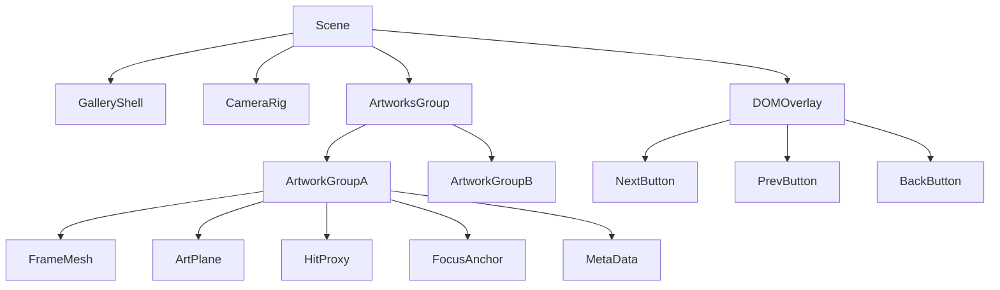
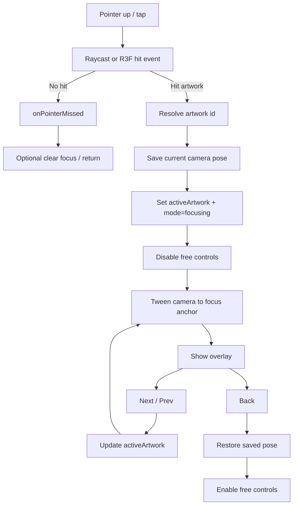

# Analytical reconstruction of the 3D artwork interaction in the reference video

## Executive summary

The reference video is publicly presented as a **3D virtual tour** of the Sistine Chapel by Manuel Bravo, and third-party coverage specifically emphasises that the tour lets viewers inspect artworks **up close** and from many angles. At the same time, I did not find any public source code or explicit stack disclosure in the reviewed materials, so the technical explanation below is a **high-confidence reconstruction** of how this interaction would be implemented on the modern web rather than a verified teardown of Bravo’s code. citeturn38view0turn38view1turn2search0

The most likely web architecture for the interaction you described is a **WebGL-based scene** with each artwork represented as a selectable scene object, plus a stored **focus anchor** per artwork. On click or tap, the app performs **hit-testing** via a raycaster, resolves the clicked artwork ID, disables free camera movement, and tweens the camera from the gallery pose to a per-artwork focus pose. While focused, a DOM overlay exposes **next**, **previous**, and **back** controls, which simply move the camera to neighbouring focus anchors or restore the previously saved gallery pose. This interaction pattern maps directly onto the APIs exposed by three.js and React Three Fiber, and it is also achievable in panorama engines via hotspot and look/zoom actions. citeturn9search0turn20view2turn20view0turn21view1turn15search10turn15search20turn37search4

For a modern browser implementation, the strongest default recommendation is **three.js + React + React Three Fiber + GSAP**. three.js provides the low-level scene graph, cameras, loaders, textures, sprites, instancing, LOD, and rendering instrumentation; React Three Fiber provides declarative scene composition, pointer events, hooks, cached loaders, and convenient integration with a web UI; GSAP is well suited to camera and UI sequencing because it can tween arbitrary JavaScript object properties and coordinate timelines cleanly. citeturn8search5turn8search6turn21view1turn22view1turn15search0turn15search10turn15search20

The interaction should **primarily use dolly/position changes**, not FOV-only zoom. Moving the camera towards the artwork preserves spatial cues, depth, and parallax; FOV tweaks can be added as a subtle accent, but if you rely on FOV changes alone the result tends to feel more like a binocular zoom than entering the artwork’s space. In three.js terms, this means tweening `camera.position` and a target/look-at point, optionally with a modest `camera.fov` adjustment and `updateProjectionMatrix()` during the tween. citeturn20view3turn20view0turn20view1turn39view0

Performance-wise, the safest pattern is to keep the environment mesh simple, use compressed or carefully managed textures, cache and lazy-load assets, clamp DPR on mobile, reduce draw calls via instancing or batching where repetition exists, and measure both draw calls and memory rather than guessing. MDN’s WebGL guidance explicitly recommends batching draw calls, using mipmaps, considering compressed textures, respecting system limits, and sometimes rendering to a smaller back buffer; three.js also exposes renderer statistics through `renderer.info`. citeturn28view0turn17search2turn17search20turn30search1turn30search0turn30search2

Accessibility should not be treated as an afterthought. The 3D canvas may drive the visual interaction, but **next/prev/back**, artwork metadata, and alternate ways to navigate should live in semantic HTML so that keyboard, screen-reader, and coarse-pointer users all have workable paths. WCAG guidance remains directly relevant here: keyboard operation, visible focus, no keyboard trap, single-pointer alternatives to gesture-only controls, and adequately sized targets all matter for this pattern. citeturn11search3turn27search0turn25search4turn25search11turn25search1turn25search3

## Evidence and confidence

The most important factual boundary is this: the reviewed public sources confirm that the reference material is a **3D virtual tour** of the Sistine Chapel, but they do **not** publicly document the precise implementation stack. My Modern Met describes Bravo’s video as a virtual tour giving a close-up view of the artwork, while Open Culture says the format allows viewers to see the chapel and its artworks from many angles and across historical states. That is enough to justify analysing the interaction pattern, but not enough to claim certainty about the exact library choices. citeturn38view0turn38view1

There is, however, a useful adjacent clue from the Vatican Museums’ own public virtual-tour pages: search metadata for the official Sistine Chapel virtual tour exposes **krpano 1.19-pr8** and **WebGL**. That matters because it shows that at least one relevant Vatican virtual-tour implementation is panorama-engine based rather than a general-purpose three.js scene. In other words, if the interaction is built atop panoramic artwork hotspots and scripted view changes, a **krpano-style implementation is plausible**; if it is built as a custom room with bespoke art objects, camera bookmarks, and DOM overlays, then **three.js/R3F is the more likely and more flexible choice**. citeturn36search0turn37search0turn37search1turn37search4

My confidence is therefore highest on the **behavioural architecture** and somewhat lower on the **exact production stack**. The behaviour itself is textbook: the user selects a hit-tested scene object, the system enters a focused state, the camera transitions to a target pose, navigation cycles through a registry of artworks, and a back action restores the saved pose. That maps cleanly onto three.js `Raycaster`, `Object3D`, `Box3`, and `PerspectiveCamera`, as well as R3F’s pointer-event layer, asset loaders, and portals. citeturn9search0turn9search1turn43view0turn43view1turn20view1turn21view1turn22view1turn21view2

## Likely interaction architecture

### Scene structure and asset model

For this specific interaction, the scene should be thought of as **two layers**: a **spatial layer** and a **UI state layer**. The spatial layer contains the gallery or chapel shell, the artworks, optional frames or hotspot markers, and one or more lights or light probes. The UI state layer tracks which artwork is active, whether the app is in free-explore or focused mode, and whether navigation controls should be visible. React Three Fiber is particularly good at this split because it is explicitly a React renderer for three.js, meaning 3D objects can respond to ordinary React state. citeturn8search6turn20view0turn11search2turn11search10

A robust artwork node generally looks like this in the scene graph:



Each `ArtworkGroup` should usually include a **visual mesh** for the artwork surface, an optional **frame mesh**, and a separate **hit proxy**. The hit proxy is often better than raycasting the ornamental frame itself because it gives predictable selection behaviour and a larger effective target on touch devices. The group also needs a **focus anchor**: an invisible `Object3D` placed at the position and orientation from which the camera should view that work. three.js’ scene graph is built on `Object3D`, and grouping is done idiomatically either with `Group` or a parent `Object3D`. citeturn9search1turn9search4

On asset types, the most likely mix is: **glTF/GLB** for room or frame geometry, **2D textures** for paintings/frescoes, and optionally **sprites** for hotspots or labels. three.js’ `GLTFLoader` exists specifically for glTF 2.0 assets; `TextureLoader` handles 2D bitmap textures; `SpriteMaterial` supports screen-facing sprites, which are useful for subtle UI markers in 3D. citeturn10search1turn10search4turn9search6

If the experience reconstructs a heritage interior like the Sistine Chapel rather than a generic white-cube gallery, the shell is likely a **low- or medium-poly architectural model** with extremely high-quality baked textures or texture projections. If, instead, the interaction is only for navigable paintings on flat walls, the whole thing can be much simpler: repeated wall sections, repeated frame geometry, unique art textures, and one focus anchor per piece. The public sources establish the tour as three-dimensional and art-centric, but not whether its underlying geometry is photogrammetric, manually modelled, or panorama-derived. citeturn38view0turn38view1turn36search0

### Camera setup and transition strategy

The most practical base camera is a **perspective camera**. three.js documents `PerspectiveCamera` as the common projection mode mimicking human vision, with controllable `fov`, `zoom`, and projection updates. For free exploration you can pair it with camera controls; for focused artwork views, you temporarily constrain or disable manual controls while the camera is animating. citeturn8search1turn19search1turn22view0

There are three common ways to create the “zoom in” feeling:

1. **Dolly**: move the camera physically closer.
2. **FOV zoom**: reduce the camera field of view.
3. **Hybrid**: dolly plus a small FOV change.

For artwork inspection, the **hybrid** is best, but with the emphasis on **dolly**. `OrbitControls` explicitly distinguishes dollying from zooming, and three.js requires `updateProjectionMatrix()` after camera-property changes such as FOV updates. In practice, dollying preserves the sense that the viewer has moved through space, while a small FOV reduction can tighten the composition. citeturn20view3turn39view0

The transition itself should tween at least four values: current camera position, current view target, control lock state, and overlay visibility. If you want more cinematic motion, you can also interpolate orientation via quaternion SLERP or maintain a target point and call `lookAt()` continuously during the tween. three.js supports `Vector3.lerp`/`lerpVectors`, quaternion SLERP, and `Object3D.lookAt()`, while GSAP can tween arbitrary object properties and sequence them with timelines. citeturn42view0turn42view1turn40search1turn20view0turn15search10turn15search20

A particularly reliable focus calculation is:

- compute `Box3` from the clicked artwork,
- take the box centre as the `lookAt` target,
- determine a viewing normal from the artwork group orientation,
- position the camera along that normal at a distance derived from artwork dimensions and desired framing.

Because `Box3.setFromObject()` computes a world-space bounding box and `getCenter()` / `getSize()` expose the centre and dimensions, it is straightforward to derive these values from arbitrary artwork groups. citeturn43view0turn43view1turn43view2

The return action should restore the viewer to the **saved pre-focus pose**, not just a generic home pose. That small detail is what makes the interaction feel coherent: users click a work, examine it, and on back they land exactly where they were in the room. If you instead return them to an arbitrary initial camera, the interaction feels discontinuous and disorienting. This is a design recommendation, but it follows directly from how camera state and interaction state are separated in typical three.js/R3F apps. citeturn11search2turn11search10turn22view1

### Input handling, hit-testing and navigation flow

The observable interaction begins with **pointer input**, and the best unifying model for desktop and mobile is **Pointer Events**. MDN and the W3C specification both describe Pointer Events as a single hardware-agnostic model covering mouse, pen, and touch. That is exactly what you want here, because click and tap should resolve to the same event pipeline. citeturn11search1turn11search5

In plain three.js, the standard sequence is:

- convert screen coordinates to **normalised device coordinates**,
- call `raycaster.setFromCamera(ndc, camera)`,
- intersect against a curated array of selectable artwork objects,
- resolve the nearest hit,
- read a stable artwork identifier from `userData` or an ancestor group.

That is not speculation; it is the intended use of `Raycaster`, which is explicitly documented for mouse picking and `setFromCamera()`-based hit tests. citeturn9search0turn20view2

In React Three Fiber, the same thing can be even simpler because objects with a `raycast` method can receive pointer events directly. R3F events carry the original DOM event plus three.js intersection data, and `event.stopPropagation()` is especially important in 3D because it prevents objects behind the current hit from also receiving events. R3F also provides `onPointerMissed`, which is a natural hook for “click outside to back out of the artwork view”. citeturn21view1turn21view0

The interaction flow is best represented as a small state machine:



Navigation between artworks should come from a **stable registry**, not from raw scene traversal each time. In practice that means an ordered array or map such as `artworks[]` with each entry containing:

- `id`
- `title`
- `meshRef`
- `focusPosition`
- `focusTarget`
- optional `nextId` / `prevId`

If you use explicit IDs, next/previous becomes trivial and consistent even if the scene graph changes. If you rely on `scene.children` order, refactors become brittle. If you need physically meaningful navigation rather than curator-defined ordering, compute a graph from spatial adjacency instead. thre.js `Object3D` and `Group` support this scene-graph organisation cleanly, while R3F lets you keep the registry in React state or context. citeturn9search1turn9search4turn11search10

### UI overlays and state management

This pattern nearly always benefits from keeping **UI controls in regular HTML**, not as 3D text floating in the scene. WebGL content can be mixed with ordinary HTML, and React makes that split particularly natural. Keep the 3D canvas focused on spatial rendering; keep metadata panels, buttons, captions, and accessibility affordances in the DOM. citeturn11search16turn12search16

If you are using React, the cleanest model is a single reducer-driven state such as:

- `mode: 'explore' | 'focusing' | 'focused' | 'returning'`
- `activeArtworkId: string | null`
- `savedPose`
- `transitionLock: boolean`

React’s `useReducer` is explicitly recommended for consolidating update logic that would otherwise be scattered across event handlers, and reducer + context scales well when your canvas, overlay panel, loading screen, and keyboard handlers all need shared state. citeturn11search2turn11search6turn11search10

On the rendering side, React Three Fiber supports hooks such as `useFrame`, `useThree`, and `useLoader`, while React DOM `createPortal` and R3F’s additional `createPortal` export let you re-parent UI or three.js subtrees when needed. If you just need HTML tied to a 3D object, Drei’s `Html` helper is expressly intended for projecting HTML content to an object’s position. citeturn22view1turn12search1turn21view2turn12search3

## Implementation plan

### Suggested file structure

A practical React/Vite/R3F structure for this interaction looks like this:

```text
src/
  main.tsx
  App.tsx
  scene/
    GalleryScene.tsx
    CameraRig.tsx
    Artwork.tsx
    Lights.tsx
  ui/
    Overlay.tsx
    LoadingScreen.tsx
    HUD.tsx
  state/
    galleryReducer.ts
    GalleryContext.tsx
  data/
    artworks.ts
  hooks/
    useArtworkNavigation.ts
    useFocusCamera.ts
  utils/
    raycast.ts
    focusMath.ts
    savePose.ts
  assets/
    gallery.glb
    frames.glb
    artworks/
      creation-of-adam.ktx2
      last-judgement.ktx2
```

Use **Vite** if you want the leanest setup: its own guide positions it as a fast build tool for modern web projects, and `vite build` produces a static bundle suitable for static hosting. If you need stronger page-level SEO around article pages, curatorial essays, or artwork routes, a **Next.js static export** shell around the interactive client-side canvas is often the best compromise. citeturn13search0turn13search8turn14search1turn14search3

### Step-by-step build sequence

1. **Create a scene shell** with a perspective camera, renderer, background, and simple lighting. In R3F, `Canvas` already provisions a scene, a perspective camera, and a raycaster by default. citeturn22view0

2. **Model each artwork as a grouped node** containing the visible art surface, optional frame, and a dedicated focus anchor. If geometry is imported from glTF, keep the exporter naming stable so you can map meshes to metadata deterministically. `GLTFLoader` and R3F `useLoader` both support this workflow, and `useLoader` caches by URL. citeturn10search1turn22view1

3. **Create an artwork registry** in code. Each registry entry should store IDs, labels, focus offsets, and ordering. This becomes the single source of truth for next/prev/back.

4. **Handle selection** using raycasting or R3F pointer events. In R3F, register `onClick` on the hit proxy; in plain three.js, attach a `pointerup` listener to the canvas and perform a raycast manually. citeturn21view1turn20view2

5. **Save the current camera pose** before transitioning. Save both position and target/orientation so that back can restore the exact prior view.

6. **Tween to focus** using GSAP. Disable free controls during the tween to prevent conflicting input. If you animate `camera.fov`, call `camera.updateProjectionMatrix()` on every update. citeturn15search10turn15search20turn39view0

7. **Show a DOM overlay** after the camera settles. Use semantic buttons for next, previous, and back. Use React DOM or a portal for modals/tooltips if needed. citeturn12search1turn12search16

8. **Implement next/previous** by resolving the active artwork’s index in the registry, then tweening to the neighbour’s focus anchor without going back to explore mode in between.

9. **Optimise assets** before polishing visuals: use glTF/GLB, compressed geometry where worthwhile, compressed textures where supported, and mipmaps for any texture seen in 3D. citeturn30search2turn30search0turn30search1turn28view0

10. **Ship as static hosting by default**. Because the backend is unspecified, a JSON manifest plus static assets on a CDN is enough for the core behaviour.

### Key code snippets

#### Raycasting and selection in vanilla three.js

```js
import * as THREE from 'three';

const raycaster = new THREE.Raycaster();
const pointer = new THREE.Vector2();
const clickables = []; // push each artwork hit proxy or group root here

function getArtworkRoot(obj) {
  let node = obj;
  while (node && !node.userData?.artworkId) node = node.parent;
  return node || null;
}

renderer.domElement.addEventListener('pointerup', (event) => {
  const rect = renderer.domElement.getBoundingClientRect();

  pointer.x = ((event.clientX - rect.left) / rect.width) * 2 - 1;
  pointer.y = -((event.clientY - rect.top) / rect.height) * 2 + 1;

  raycaster.setFromCamera(pointer, camera);
  const hits = raycaster.intersectObjects(clickables, true);

  if (!hits.length) {
    if (state.mode === 'focused') returnToGalleryPose();
    return;
  }

  const artwork = getArtworkRoot(hits[0].object);
  if (!artwork) return;

  focusArtwork(artwork.userData.artworkId);
});
```

This follows the intended three.js picking model: convert pointer coordinates to NDC, call `setFromCamera()`, then intersect against target meshes. `Raycaster` is explicitly documented for mouse picking, and `setFromCamera()` is the standard method for deriving the ray from camera and NDC coordinates. citeturn20view2turn9search0

#### Camera tweening with GSAP

```js
import gsap from 'gsap';
import * as THREE from 'three';

const tmpBox = new THREE.Box3();
const tmpCenter = new THREE.Vector3();
const tmpSize = new THREE.Vector3();
const tmpQuat = new THREE.Quaternion();
const WORLD_FORWARD = new THREE.Vector3(0, 0, 1);

let savedPose = null;

function savePose() {
  savedPose = {
    position: camera.position.clone(),
    target: controls.target.clone(),
    fov: camera.fov
  };
}

function focusArtwork(artworkId) {
  const artwork = artworkMap.get(artworkId);
  if (!artwork) return;

  if (!savedPose) savePose();

  tmpBox.setFromObject(artwork.group, true);
  tmpBox.getCenter(tmpCenter);
  tmpBox.getSize(tmpSize);

  artwork.group.getWorldQuaternion(tmpQuat);
  const normal = WORLD_FORWARD.clone().applyQuaternion(tmpQuat).normalize();

  const distance = Math.max(tmpSize.x, tmpSize.y) * 1.35;
  const targetPos = tmpCenter.clone().add(normal.multiplyScalar(distance));

  controls.enabled = false;
  state.mode = 'focusing';
  state.activeArtworkId = artworkId;

  gsap.timeline({
    defaults: { duration: 1.0, ease: 'power3.inOut' },
    onComplete: () => {
      state.mode = 'focused';
    }
  })
  .to(camera.position, {
    x: targetPos.x,
    y: targetPos.y,
    z: targetPos.z,
    onUpdate: () => camera.lookAt(tmpCenter)
  }, 0)
  .to(controls.target, {
    x: tmpCenter.x,
    y: tmpCenter.y,
    z: tmpCenter.z
  }, 0)
  .to(camera, {
    fov: 38,
    onUpdate: () => camera.updateProjectionMatrix()
  }, 0);
}

function returnToGalleryPose() {
  if (!savedPose) return;
  state.mode = 'returning';

  gsap.timeline({
    defaults: { duration: 0.9, ease: 'power3.inOut' },
    onComplete: () => {
      state.mode = 'explore';
      state.activeArtworkId = null;
      controls.enabled = true;
    }
  })
  .to(camera.position, {
    x: savedPose.position.x,
    y: savedPose.position.y,
    z: savedPose.position.z
  }, 0)
  .to(controls.target, {
    x: savedPose.target.x,
    y: savedPose.target.y,
    z: savedPose.target.z
  }, 0)
  .to(camera, {
    fov: savedPose.fov,
    onUpdate: () => camera.updateProjectionMatrix()
  }, 0);
}
```

Here the focus framing depends on `Box3.setFromObject()`, `getCenter()`, and `getSize()`, while orientation is maintained with `lookAt()`. GSAP is suitable because it can tween arbitrary JS object properties and coordinate multiple tweens in one timeline. citeturn43view0turn43view1turn43view2turn20view0turn15search10turn15search20

#### Navigation logic in React

```tsx
type State = {
  mode: 'explore' | 'focusing' | 'focused' | 'returning';
  activeArtworkId: string | null;
};

type Action =
  | { type: 'FOCUS'; id: string }
  | { type: 'NEXT' }
  | { type: 'PREV' }
  | { type: 'BACK' }
  | { type: 'FOCUSED' }
  | { type: 'EXPLORE' };

const orderedIds = artworks.map((a) => a.id);

function reducer(state: State, action: Action): State {
  switch (action.type) {
    case 'FOCUS':
      return { ...state, mode: 'focusing', activeArtworkId: action.id };

    case 'NEXT': {
      if (!state.activeArtworkId) return state;
      const i = orderedIds.indexOf(state.activeArtworkId);
      return { ...state, mode: 'focusing', activeArtworkId: orderedIds[(i + 1) % orderedIds.length] };
    }

    case 'PREV': {
      if (!state.activeArtworkId) return state;
      const i = orderedIds.indexOf(state.activeArtworkId);
      return { ...state, mode: 'focusing', activeArtworkId: orderedIds[(i - 1 + orderedIds.length) % orderedIds.length] };
    }

    case 'BACK':
      return { ...state, mode: 'returning' };

    case 'FOCUSED':
      return { ...state, mode: 'focused' };

    case 'EXPLORE':
      return { mode: 'explore', activeArtworkId: null };

    default:
      return state;
  }
}
```

This is the kind of situation `useReducer` is designed for: state transitions are explicit, repeatable, and easier to reason about than ad hoc `useState` calls scattered throughout click handlers. citeturn11search2turn11search6

## Minimal reproducible example

For the smallest reproducible version of the behaviour, I would not start with a full chapel shell. I would start with **three painting planes on one wall**, each with a texture and a focus anchor. That strips the problem to its essence: click-to-focus, next, previous, and back.

### Minimal file layout

```text
mre/
  index.html
  styles.css
  main.js
  artworks.js
```

### Pseudo-code outline

```text
index.html
  - canvas container
  - overlay panel with title + next/prev/back buttons

artworks.js
  export const artworks = [
    { id, title, textureUrl, position, focusPosition, focusTarget },
    ...
  ]

main.js
  - create scene, camera, renderer
  - add wall mesh
  - for each artwork:
      create plane mesh with texture
      set mesh.userData.artworkId
      add invisible larger hit proxy if desired
  - maintain state:
      mode, activeArtworkId, savedPose
  - on pointerup:
      raycast
      if hit -> savePose if first focus -> tween camera to focus
      if miss and focused -> restore pose
  - buttons:
      next -> resolve next artwork -> tween
      prev -> resolve previous artwork -> tween
      back -> restore pose
  - render loop

styles.css
  - fixed overlay
  - pointer-friendly buttons
  - hidden overlay in explore mode
```

### Minimal behavioural logic

- **Explore mode**: overlay hidden, free orbit or static camera.
- **Hit artwork**: select nearest hit, save current pose, tween to artwork focus.
- **Focused mode**: overlay visible, keyboard and button handlers active.
- **Next/prev**: swap active artwork ID, retween from current focus to neighbour focus.
- **Back**: tween to saved pose, clear active ID, hide overlay.

If you want the shortest path to something demonstrable, this MRE should use **vanilla three.js + GSAP**. If you want the shortest path to something production-friendly with richer UI, the same logic drops naturally into **R3F + React**. citeturn8search5turn15search10turn8search6

## Alternatives and trade-offs

### Technology stack comparison

The table below is an **inferred engineering assessment**, grounded in official documentation but still qualitative. It is intended to help choose the right stack for this interaction pattern rather than to state absolute truths.

| Stack | Ease of development | Runtime performance | SEO and discoverability | Integration with web UI | Best use case |
|---|---|---:|---|---|---|
| Vanilla three.js | Medium | High | Medium to high | Medium | Maximum control, minimal abstraction, custom engine work |
| React Three Fiber | High for React teams | High | High | Very high | Rich UI + 3D integration, stateful interfaces, faster iteration |
| krpano | High for panorama tours | High for hotspots/panoramas | Medium | Medium | Panorama-based museum tours with scripted look/zoom/hotspots |
| Unity WebGL | Medium if Unity-native team, lower otherwise | High visual fidelity, but heavier payloads | Lower | Lower | Reusing an existing Unity pipeline or complex editor-driven content |

These ratings follow from the documented nature of the tools. three.js is a low-level 3D library; React Three Fiber is a React renderer for three.js with direct React-state integration, events, hooks, and portals; krpano exposes hotspot, look, zoom, tween, and scene-loading actions for tours; Unity WebGL publishes a browser build consisting of loader/framework/wasm/data files and carries web-platform limitations that matter for integration and delivery. citeturn8search5turn8search6turn21view1turn21view2turn37search4turn16view1turn16view2turn16view0

The main trade-offs are straightforward. **Vanilla three.js** gives you absolute control and often the smallest conceptual surface area once the interaction is defined, but you must build your own state discipline and DOM integration patterns. **R3F** reduces boilerplate, makes UI and 3D coexist naturally, and is usually the best fit for this exact pattern because artwork focus is a UI-heavy state machine. **krpano** is compelling if your source material is really a set of panoramic images with hotspots rather than a general 3D scene, especially since official Vatican tour metadata points in that direction for at least some public tours. **Unity WebGL** is usually the wrong first choice for a content-led museum interaction unless you already have strong Unity tooling or content pipelines, because DOM/UI/SEO friction is higher and the deployment artefacts are heavier. citeturn36search0turn37search4turn8search6turn12search1turn16view2turn16view0

There are also important **camera** and **physics** trade-offs. For this pattern, use **scripted transforms and tweening**, not physics. Physics adds indeterminism, tuning overhead, and accessibility problems for little gain unless the viewer must physically collide with the environment. Likewise, use **dolly-first** camera moves for entering artworks; reserve strong FOV changes for accent or panorama-style zooming. These are design recommendations, but they align with the documented separation of dolly/zoom in controls and with the camera semantics of perspective projection. citeturn20view3turn20view1

On instancing, the rule is nuanced. `InstancedMesh` is excellent when many objects share the same geometry and material, because it reduces draw calls; it is therefore ideal for repeated frames, spot markers, or pedestals. It is **not** automatically a win for artworks if each picture needs a unique material or texture. In that case, a common optimisation is to instance the repeated frame geometry while keeping the artwork planes separate, or to atlas textures if curation permits. citeturn9search2turn17search20turn30search1

## Testing, metrics and deployment

### Testing checklist

A sensible checklist for this interaction should cover behaviour, performance, accessibility, and platform compatibility.

- **Functional**
  - Clicking the artwork surface focuses the correct piece.
  - Clicking a frame ornament does not accidentally select the wrong object.
  - Clicking outside while focused triggers `back` only when intended.
  - Next/previous always resolves to stable neighbours.
  - Back restores the exact saved camera pose, not an approximate one.

- **Animation**
  - Manual controls are disabled during camera tweening.
  - Repeated rapid taps cannot queue broken transitions.
  - FOV changes, if used, always call `updateProjectionMatrix()`. citeturn39view0

- **Performance**
  - Textures load progressively or behind a loading state.
  - Unused materials and textures are disposed.
  - Draw calls and memory are measured during navigation, not just at idle. `renderer.info` is intended for this sort of debugging and monitoring, while the Performance API can help track memory usage. citeturn17search2turn29search3turn29search4turn31search14turn31search7

- **Input and device**
  - Mouse, touch, and pen all trigger the same logical path through Pointer Events.
  - Touch gestures do not get cancelled unexpectedly because of missing `touch-action` rules.
  - Buttons remain comfortably tappable on coarse pointers. citeturn11search1turn11search9turn25search3

- **Accessibility**
  - Next/prev/back are reachable by keyboard.
  - Focus is clearly visible.
  - No keyboard trap occurs when the overlay opens.
  - Hover-only metadata is also available on focus.
  - Gesture-only controls have single-pointer or button alternatives. citeturn25search4turn25search11turn25search17turn25search1turn25search9

### Performance metrics to target

For web-page quality as a whole, I would target the current Core Web Vitals thresholds of **LCP ≤ 2.5s**, **INP ≤ 200ms**, and **CLS ≤ 0.1** at the 75th percentile. Those are official web-quality targets and matter even for 3D experiences because the user still judges the whole page, not just the canvas. citeturn33view1turn33view0turn33view2turn33view3

For the 3D scene itself, the right approach is to set **engineering targets** and validate them on real devices rather than treating them as universal constants. Good starting targets are:

- desktop: **steady 60fps** while rotating or switching artworks;
- mid-range mobile: **at least 30fps** during transitions;
- interaction latency that feels immediate, with no visible pause before the camera starts moving;
- draw calls low enough that mobile remains comfortable after UI overlays appear;
- texture memory measured and reduced if navigation causes spikes.

These are recommendations rather than standards. MDN’s guidance is clear that WebGL system limits vary significantly across devices, and it specifically recommends batching draw calls, using mipmaps, considering compressed textures, respecting `devicePixelRatio`, and adapting to system limits instead of assuming your development machine is representative. citeturn28view0turn22view2turn17search20turn30search1turn30search0

### Deployment and build tooling

With no backend specified, the cleanest default deployment is a **static front end** plus static assets on a CDN. Vite is particularly attractive because it is built for modern front-end development and outputs a static production bundle with `vite build`. This is enough if your artwork metadata is embedded in the bundle or loaded from a static JSON file. citeturn13search0turn13search8

If SEO matters for surrounding essays, artwork landing pages, or search discoverability of curatorial text, pair the interactive scene with **Next.js static export** routes. Next’s static-export documentation makes clear that the exported site can be hosted on any standard static server, which is often the best blend of SEO-friendly HTML and client-side 3D interactivity. citeturn14search1turn14search3

If you choose **Unity WebGL**, plan for a different delivery shape: Unity documents a build folder containing a loader script, framework script, WebAssembly binary, and data file, with optional memory and symbols artefacts. Unity also documents important web-platform limitations such as restricted filesystem access, browser-dependent support differences, networking limitations, and some threading/debugging constraints. That does not make Unity unusable, but it does materially affect payload size, hosting, debugging, and integration with the rest of the web page. citeturn16view2turn16view0turn16view1

### Open questions and limitations

The main limitation is straightforward: **the reviewed public materials do not disclose the exact source code or library stack** behind the reference video, so no one can honestly claim a verified component-by-component teardown from these sources alone. What can be stated with confidence is the public framing of the video as a 3D virtual tour, the neighbouring evidence that Vatican virtual tours can be built with WebGL and krpano, and the fact that the behaviour you described aligns precisely with well-documented patterns in three.js, R3F, GSAP, and panorama-tour engines. citeturn38view0turn38view1turn36search0turn37search4turn8search5turn8search6

If the underlying experience is actually a **panoramic tour with scripted view bookmarks**, a krpano-like stack is more plausible than a full room model. If it is a **custom spatial reconstruction with individually navigable artworks and DOM overlays**, a three.js/R3F stack is more plausible. Either way, the implementation plan and MRE above will reproduce the core behaviour you asked for on modern browsers, including mobile, without assuming any backend. citeturn36search0turn37search4turn8search6turn21view1